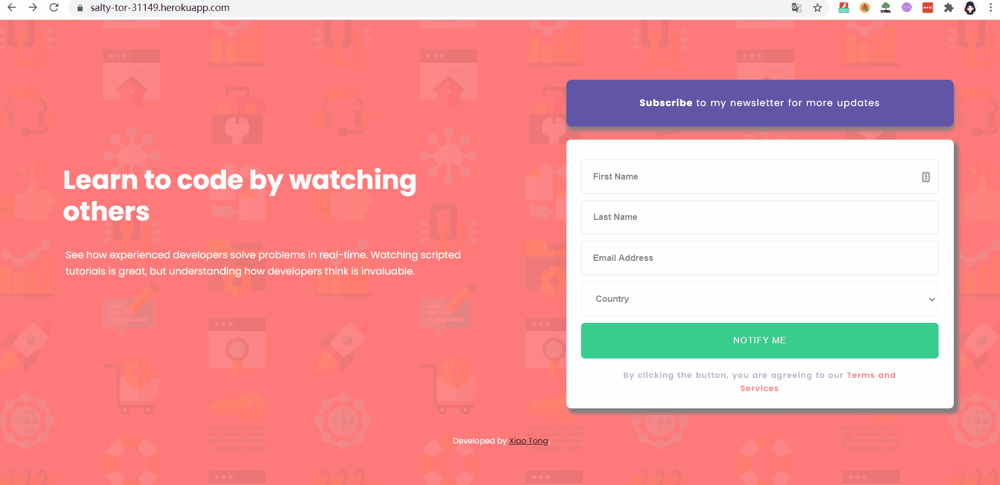

# 📩 Express Newsletter Sign Up Page

## 🚀 Live Demo
[News Letter Sign Up Page](https://newsletter-signup-5vmf.onrender.com/)

## 🎬 Display


---

## 📖 Project Overview
This is a simple **Newsletter Sign Up application** built with **Express (Node.js)**.  
The frontend form collects a user's **first name, last name, email, and country**, while the backend integrates with the **Mailchimp Marketing API** to store subscriber data in a Mailchimp Audience list.  

The app is deployed on **Render**, making it a great example project for understanding how to go from:
**Frontend form ➝ Backend processing ➝ MailChamp API➝ Deployment.**

---

## ⚙️ Run Locally
1. Clone the repository:
   ```bash
   git clone <your-repo-url>
   cd newsletter-signup

1. Install dependencies:

   ```
   npm install
   ```

2. Create a `.env` file in the root directory with your Mailchimp configuration:(如果不会搞问下gpt这两个在mail champ里去哪找怎么设置)

   ```
   MC_API_KEY=your_api_key-usX
   MC_LIST_ID=your_list_id
   ```

3. Start the server:

   ```
   node app.js
   ```

   Then open http://localhost:3000 in your browser.

------


## ⚠️ Notes

- **Port handling**: never hardcode the port. Use:

  ```
  const PORT = process.env.PORT || 3000;
  app.listen(PORT, () => console.log(`Server running on ${PORT}`));
  ```

- **Security**: do not hardcode your Mailchimp API key or List ID in code — always use environment variables.

- **COUNTRY field**: if you want to save a custom `COUNTRY` field, you must create a merge tag called `COUNTRY` in your Audience settings.

- **Avoid duplicates**: use `setListMember` instead of `addListMember`, so existing subscribers are updated instead of causing errors.

------

## 🛠️ Tech Stack

- **Frontend**: HTML, CSS
- **Backend**: Node.js, Express
- **API**: Mailchimp Marketing API
- **Deployment**: Render / Heroku