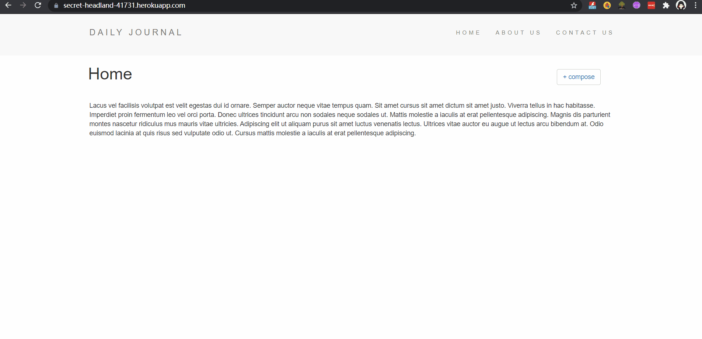

# 📓 Mongoose Daily Journal APP

## 🎬 Display



## 🔗 Check Out the APP

👉 [https://daily-journal-d19y.onrender.com/](https://daily-journal-d19y.onrender.com/)

------

## 📖 Overview

This repository contains a simple **Express + EJS** web app backed by **MongoDB Atlas** via **Mongoose**.
 It allows you to **publish ✍️, store 💾, and delete 🗑 daily journal entries**.
 All server logic is contained in `app.js`.

**Key features**:

- ➕ Create new journal posts from the homepage form
- 👀 View posts on the home feed
- 🔗 Visit a post’s dedicated route
- ❌ Delete posts

------

## 🚀 Getting Started (Local)

1. 📥 Clone & install

   ```
   git clone https://github.com/kkkokili/web-projects.git
   cd web-projects/fullstack/nodeJs/mongoose-daily-journal-app
   npm install
   ```

2. 🔑 Configure environment variables
    Create a `.env` file in the project root (or set the variables in your host):

   ```
   
   MONGO_PASS=<YOUR_PASSWORD>     # same password as in the Authentication-Secrets project
   
   ```

   > ⚠️ **Note:** The password here is **the same** as the one you use in the **Authentication-Secrets** app.

3. ⚙️ Connect to MongoDB (sample code)

   ```
   require('dotenv').config();
   const mongoose = require('mongoose');
   
   const { MONGO_USER, MONGO_PASS, DB_NAME, APP_NAME } = process.env;
   
   const SRV =
     `mongodb+srv://${MONGO_USER}:${MONGO_PASS}` +
     `@cluster0.irgncm5.mongodb.net/?retryWrites=true&w=majority&appName=${APP_NAME || 'Cluster0'}`;
   
   mongoose.connect(SRV, {
     dbName: DB_NAME || 'JournalDB',
     useNewUrlParser: true,
     useUnifiedTopology: true,
   })
   .then(() => console.log('✅ Mongo connected'))
   .catch(err => console.error('❌ Mongo connect error:', err));
   ```

4. ▶️ Run the app

   ```
   node app.js
   ```

   Then visit:

   ```
   http://localhost:3000
   ```

------

## ☁️ Deployment (Heroku Notes)

- Set environment variables (`MONGO_USER`, `MONGO_PASS`, `DB_NAME`, `APP_NAME`) in **Heroku Config Vars**.

- Ensure your server listens on the dynamic port:

  ```
  app.listen(process.env.PORT || 3000, () => console.log('Server started'));
  ```

- Use the Node.js buildpack.

------

## 🛠 Tech Stack

- **HTML, CSS, JS** 🎨
- **Node.js, Express** ⚡
- **EJS** 📑
- **MongoDB Atlas, Mongoose** 🍃
- **Heroku** 🚀

