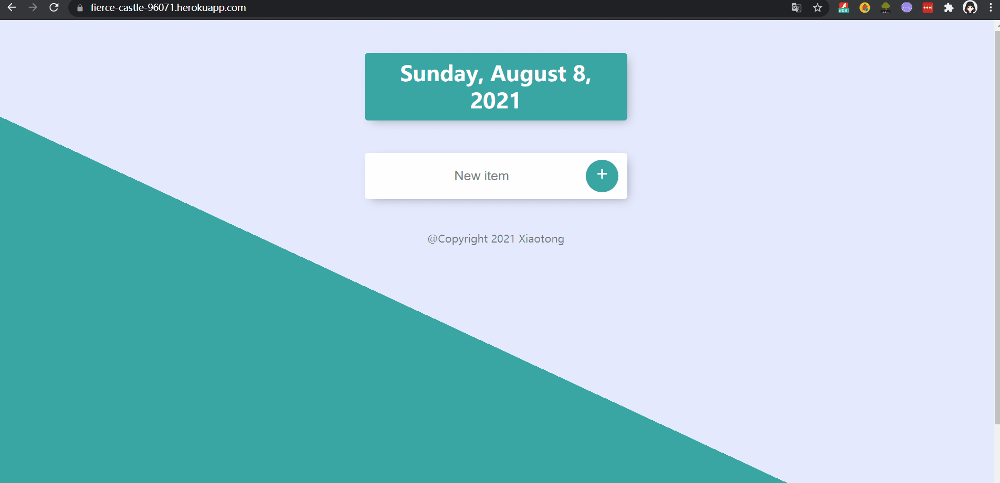

# 📝 ToDo List — Express + Mongoose

**👉 Live Demo:** *[to-do-list](https://todolist-app-2q8o.onrender.com/)*

## Display:<br/>



------

## What this repo is

A minimal but solid **To-Do List** web app built with **Express + EJS + Mongoose 7**.
 It supports a default “Today” list and **auto-created custom lists** via dynamic routes (e.g., `/Work`, `/Groceries`).

> The **MongoDB password is the same as the one you used in your \*Authentication-Secrets\* project’s Mongoose setup.**

------

## ✨ Features

- ✅ Add / delete tasks
- 📅 Default list shows **today’s date**
- 🗂️ **Dynamic lists**: visit `/:topic` to auto-create & view a custom list
- ⚙️ **Mongoose 7 (async/await, no callbacks)** + MongoDB Atlas
- 🧩 EJS templating + Express routes
- 🚀 Ready for Render deployment (dynamic port supported)

------

## 🧰 Skills / Stack

**HTML, CSS, JS, Node.js, Express, EJS, MongoDB, Mongoose, Render**
 (+ **Lodash** for neat title-casing)

------

## 📁 Project Structure (excerpt)

```
fullstack-Express-Mongoose-todoList-app/
├─ app.js
├─ views/
│  ├─ index.ejs
│  └─ about.ejs
├─ static/
├─ gif/
│  └─ todoList.gif
├─ package.json
└─ .env                      # local only (not committed)
```

------

## ⚙️ How to run locally

> Requires **Node.js ≥ 18** (recommended **20.x**).
>  Your **MongoDB password is the same** as in the Authentication-Secrets project.

1. Install:

```
npm install
```

1. Create a **`.env`** in the project root (do not commit it):

```
passWord(can be configed in Render env variable, it's mongoose pwd)
NODE_VERSION 
```

1. Start:

```
npm start
```

Open `http://localhost:3000`.

> The server listens on `process.env.PORT || 3000`, so **Render’s random port** works out of the box.

------

## ☁️ How to deploy on Render

1. **Root Directory:** `fullstack/nodeJs/mongoose/fullstack-Express-Mongoose-todoList-app`

2. **Start Command:** `npm start`

3. **Environment variables (pick one style):**

   ```
   passWord=<your Atlas password>
   NODE_VERSION=20.17.0
   ```

4. Ensure Node version:

   - In `package.json`:

     ```
     { "type": "module", "engines": { "node": "20.17.0" }, "scripts": { "start": "node app.js" } }
     ```

5. **Only use SRV URIs** (`mongodb+srv://…`). If you ever see `[DEP0170] mongodb://...:27017`, it means some old `mongodb://` URI still exists in code or env—replace it with SRV.

------

## 🗃️ Data Models

```
// Task: items in the default "Today" list
{ _id, name }

// paramList: named custom list with embedded items
{
  _id,
  name,                 // e.g., "Work"
  items: [{ _id, name }]
}
```

------

## 🛠️ Troubleshooting

- **`Model.find() no longer accepts a callback`** → You’re on **Mongoose 7**; use **async/await** only.
- **`[DEP0170] mongodb://...` warning** → Some env/old code still uses `mongodb://…:27017…`; switch to `mongodb+srv://…`.
- **`Cannot find module 'node:async_hooks'`** → Your Node runtime is too old. Use **Node ≥ 14.18** (prefer **18/20**).
- **Windows LF/CRLF** messages from Git → Not errors; you can ignore or set `git config --global core.autocrlf true`.

####  

